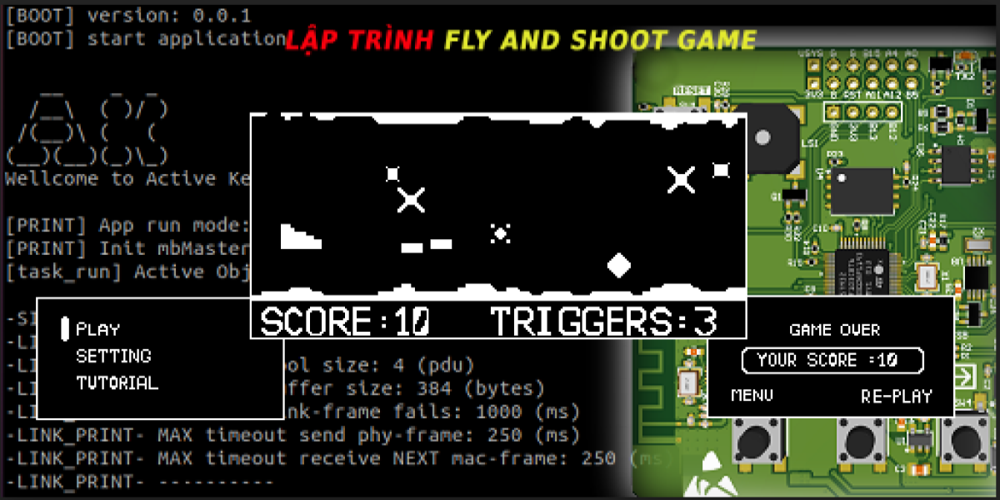

<div align="center">


<br>


</div>

# FLY AND SHOOT Game trên AK-Embedded Base Kit

<center>

</center>

<hr>

## Giới thiệu

**Fly and Shoot** là tựa game bắn súng dọc được tái tạo trên nền tảng **AK-Embedded Base Kit**, chạy trên framework **Active Kernel (AK)** với cơ chế Event-Driven. Người chơi điều khiển tàu bay né quặng, bom và đường hầm, đồng thời bắn đạn để phá hủy vật cản ăn điểm.

Điểm nổi bật của Fly and Shoot trong dòng game AK:

- **Bắn đạn phá vật cản:** Khác với các game AK chỉ né tránh, Fly and Shoot cho phép tàu bay bắn đạn để tiêu diệt quặng, bom và ghi điểm — tạo lối chơi chủ động.
- **Đạn dược có giới hạn:** Số đạn tối đa (1-5 viên) cấu hình được trong màn hình SETTING, buộc người chơi tính toán thời điểm bắn.
- **Cơ chế Event-Driven đầy đủ:** Toàn bộ game (7 task, nhiều signal/timer) xây dựng trên nền tảng Task & Signal, phản ứng theo sự kiện một cách tự nhiên.
- **Độ khó:** Chọn EASY, NORMAL, HARD trong cài đặt để tăng tốc độ và mật độ vật cản.
- **Lịch sử:** Điểm số, lịch sử và cài đặt được ghi/đọc từ EEPROM, giữ nguyên sau khi tắt nguồn.

## Tài liệu

| File | Mô tả |
|---|---|
| [1. Giới Thiệu](docs/01-gioi-thieu.md) | Phần cứng AK Kit, menu, các đối tượng, cách chơi và tính điểm |
| [2. Task và Signal](docs/02-task-signal.md) | Event-Driven, các task, signal và sequence trong game |
| [3. Đối tượng](docs/03-doi-tuong.md) | Chi tiết code từng đối tượng: Plane, Missile, Obstacle, Explosion, Tunnel Wall |
| [4. Hình ảnh](docs/04-hinh-anh.md) | Workflow tạo hình ảnh và animation |
| [5. Âm thanh](docs/05-am-thanh.md) | Âm thanh và file `fs_buzzer_def.h` |
| [6. State machine](docs/06-state-machine.md) | State-machine chuyển đổi giữa các màn hình |

---

## I. Phần cứng

[AK Embedded Base Kit](https://epcb.vn/products/ak-embedded-base-kit-lap-trinh-nhung-vi-dieu-khien-mcu) là evaluation kit dành cho các bạn học phần mềm nhúng nâng cao và muốn thực hành với Event-Driven. Kit tích hợp OLED, 3 nút bấm, buzzer, RS485, Grove và các ngoại vi khác.

Xem chi tiết tại [file](docs/01-gioi-thieu.md).

#### Thông số & Flash Partition Layout

- **MCU:** STM32L151C8T6 (ARM Cortex-M3)

| Memory Range | Size | Partition | Description |
|---|---|---|---|
| `0x08000000 - 0x08001FFF` | 8 KB | Bootloader | AK Bootloader Partition |
| `0x08002000 - 0x08002FFF` | 4 KB | BSF Shared | Data sharing giữa Bootloader & Application |
| `0x08003000 - 0x0801FFFF` | 116 KB | Application | **Fly and Shoot Firmware** |

> **Ghi chú:** Các khoảng bộ nhớ trên lấy từ linker file `application/sources/platform/stm32l/ak.ld`.

---

## II. Cách chơi

- Nhấn **[UP]** để tàu bay đi lên; thả ra tàu bay tự rơi xuống.
- Nhấn **[MODE]** để bắn đạn phá hủy quặng/bom (số đạn cấu hình trong SETTING, tối đa 5).
- **Tính điểm:** Quặng nhỏ = 1 điểm, quặng lớn = 2 điểm, bom = 0 điểm.
- **Thua:** Tàu bay chạm quặng, bom hoặc đường hầm (TUNNEL WALL) → nổ và game over.
- **Chế độ độ khó:** EASY, NORMAL, HARD (cài trong SETTING).
- Khi game over: nhấn **[MODE]** chơi lại, nhấn **[DOWN]** về menu.

---

## III. Cách Build, Flash & Chạy

Bạn có thể chọn một trong hai cách dưới đây để nạp và chạy game trên board.

### Cách 1: Build từ source

##### 1. Cài toolchain
Cài `arm-none-eabi-gcc` và thêm vào `PATH`. Kiểm tra:
```sh
arm-none-eabi-gcc --version
```

##### 2. Compile firmware
Vào thư mục `application/` và biên dịch:
```sh
cd application
make
```
*File build tạo trong folder `build_ak-kit-fly-and-shoot-application/`, binary đầu ra là `ak-kit-fly-and-shoot-application.bin`.*

##### 3. Nạp lên board
Nạp qua cổng serial USB bằng tool `ak-flash`:
```sh
make flash dev=/dev/ttyUSB0
```
Hoặc nếu dùng ST-LINK, flash một lệnh:
```sh
make flash
```

### Giám sát log Serial
Mở giao tiếp serial (`minicom`) ở baudrate `115200` để xem log game theo thời gian thực:
```sh
make com dev=/dev/ttyUSB0
```

---

**My contact:** <br/>
<a href="https://github.com/dovantuan02">
  
</a>
<a href="https://www.linkedin.com/in/do-van-tuan">
  
</a>
<a href="mailto:dovantuan285@gmail.com">
  
</a>