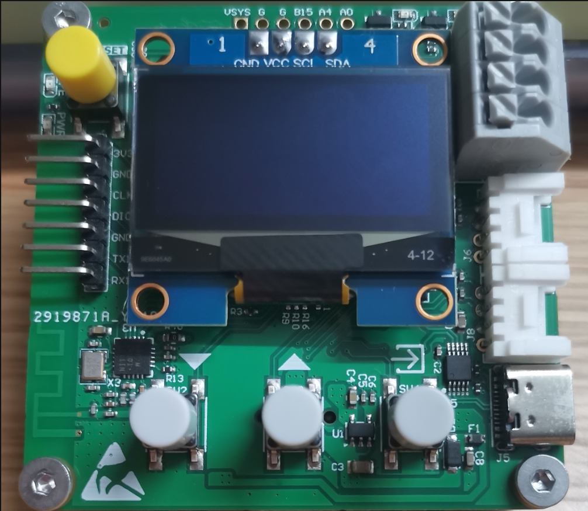
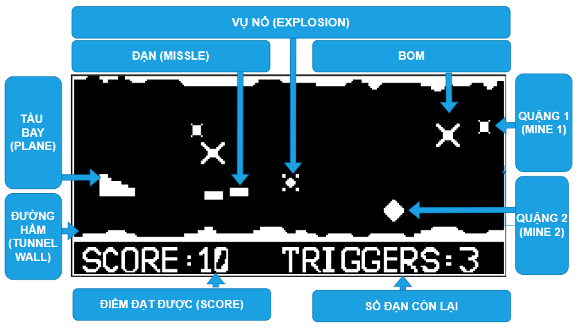

# I. Giới thiệu

[⬅ Quay lại README](../README.md)

## 1.1. Giới thiệu sơ lược về phần cứng

- AK-Embedded Base Kit là evaluation kit dành cho các bạn học phần mềm nhúng nâng cao và muốn thực hành với Event-Driven.
- Các ngoại vi và MCU được tích hợp vào trong Kit:
    - Vi điều khiển chính STM32 ARM-based 32-bit MCU: [STM32L151C8T6](https://www.st.com/en/microcontrollers-microprocessors/stm32l151c8.html)
    - Truyền nhận không dây 2.4GHz RF Transceiver ICs: [NRF24L01P-R](https://www.nordicsemi.com/products/nrf24-series)
    - Giao tiếp có dây trong công nghiệp RS485 50Mbps: [THVD1450DR](https://www.ti.com/product/THVD1450/part-details/THVD1450DR)
    - Tích hợp loa dùng để làm game Buzzers Magnetic: [MLT-8530](https://www.lcsc.com/product-detail/Buzzers_Jiangsu-Huaneng-Elec-MLT-8530_C94599.html)
    - Tích hợp NOR FLASH (32MB): [W25Q256JVEIQTR](https://www.winbond.com/hq/product/code-storage-flash-memory/serial-nor-flash/index.html?__locale=en&partNo=W25Q256JV)
    - Kết nối với các mạch ứng dụng chuẩn [Seeedstudio Grove Header HY-4AW](https://wiki.seeedstudio.com/Grove_System/)
    - Tích hợp console qua USB type C sử dụng chip USB UART Converter: [CH340E](http://www.wch-ic.com/products/CH340.html)

## 1.2. Màn hình Menu

| Mục | Chức năng |
| --- | --- |
| PLAY | Bắt đầu trò chơi |
| SETTING | Cài đặt các thông số cho trò chơi (mode, đạn, âm thanh) |
| TUTORIAL | QR hướng dẫn trò chơi |
| HISTORY | Lưu lịch sử điểm sau những lần chơi |
| EXIT | Thoát màn hình menu |

## 1.3. Các đối tượng hoạt động trong game

| Đối tượng | Ý nghĩa | Người chơi tác động | Tự động tác động |
| --- | --- | --- | --- |
| PLANE | Tàu bay | Di chuyển tàu bay đi lên | Di chuyển tàu bay đi xuống, chạm quặng, bom sẽ tạo vụ nổ và kết thúc game |
| MISSILE | Đạn | Bắn ra đạn phá hủy quặng, bom | Di chuyển, tạo vụ nổ khi chạm quặng/bom, tạo điểm khi chạm quặng |
| MINE | Quặng | Không | Di chuyển, tự động tạo ra |
| BOM | Bom | Không | Di chuyển, tự động tạo ra |
| EXPLOSION | Vụ nổ | Không | Vụ nổ xảy ra khi đạn chạm quặng hoặc bom |
| TUNNEL WALL | Đường hầm | Không | Di chuyển bản đồ |

## 1.4. Cách chơi của game

Người chơi nhấn [UP] để tàu bay đi lên, hoặc để tàu bay tự động rơi xuống để né quặng và bom. Đồng thời không được để tàu bay chạm vào đường hầm (TUNNEL WALL).
Tăng độ khó bằng cách vào cài đặt và chỉnh mode (EASY, NORMAL, HARD).
Người chơi nhấn nút [MODE] để bắn đạn. Khi đạn chạm trúng quặng sẽ tạo ra điểm. Số đạn có thể tùy chỉnh trong SETTING (từ 1 đến tối đa 5 viên).

*Cách tính điểm:*

- Quặng nhỏ: 1 điểm khi bắn trúng.
- Quặng lớn: 2 điểm khi bắn trúng.
- Bom: không có điểm khi bắn trúng.

Điểm được lưu khi trò chơi kết thúc. Khi game over, nhấn [MODE] để chơi tiếp, nhấn [DOWN] để quay về menu.

[⬅ Quay lại README](../README.md)
