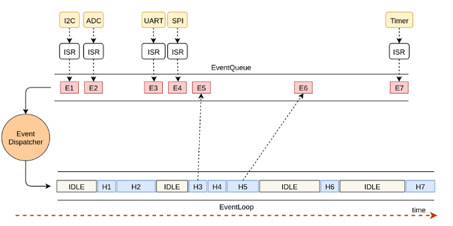
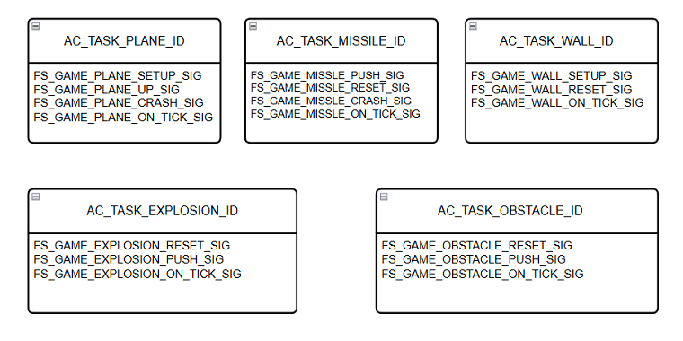
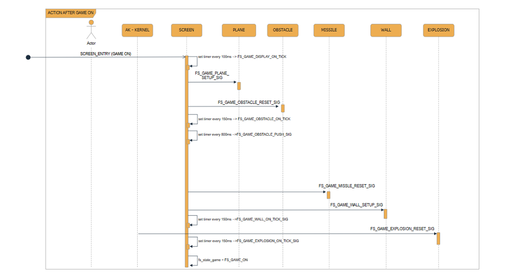
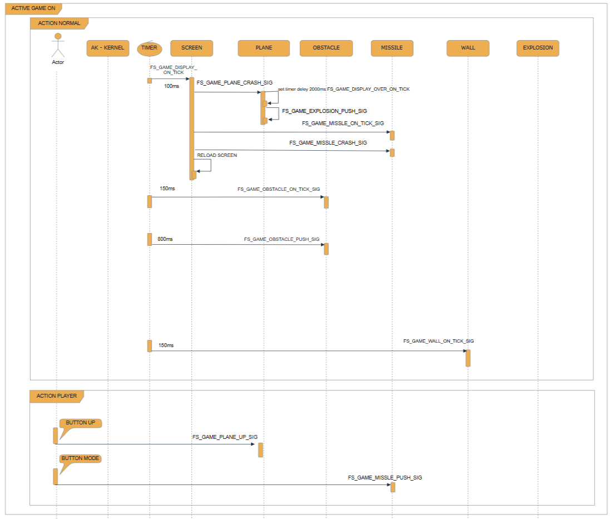
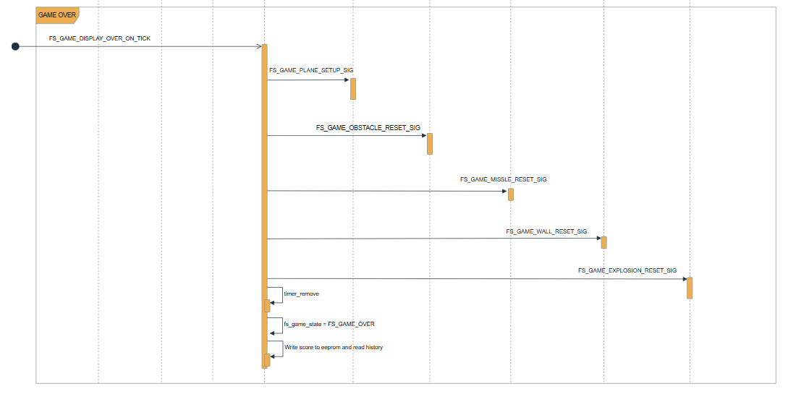

# II. Thiết kế các Task, Signal trong game

[Quay lại README](../README.md)

## 2.1. Event-Driven hoạt động như thế nào?

Nguồn: Automatic Control Programming

- Event-Driven là hệ thống gửi thư (message) để thực thi công việc. Task là người nhận thư, Signal là nội dung công việc. Task và Signal là nền tảng của hệ Event-Driven.
- Mỗi Task nhận một nhóm công việc nhất định, ví dụ: quản lý state-machine, quản lý hiển thị màn hình, quản lý cập nhật phần mềm, quản lý watchdog...
- Message chia làm 2 loại: chỉ chứa Signal, hoặc vừa chứa Signal vừa chứa Data. Message tương đương với Signal.
- Nơi thực thi công việc gọi là Handler.

## 2.2. Task và Signal trong Fly - And - Shoot

*Các Task và Priority trong game:*

| TASK ID | PRIORITY | HANDLER |
| --- | --- | --- |
| FS_GAME_TASK_DISPLAY_GAME_ON_ID | TASK_PRI_LEVEL_4 | task_scr_fs_game_on_handle |
| FS_GAME_TASK_PLANE_ID | TASK_PRI_LEVEL_4 | task_fs_plane_hanle |
| FS_GAME_TASK_MISSLE_ID | TASK_PRI_LEVEL_4 | task_fs_missle_handle |
| FS_GAME_TASK_WALL_ID | TASK_PRI_LEVEL_4 | task_fs_wall_handle |
| FS_GAME_TASK_EXPLOSION_ID | TASK_PRI_LEVEL_4 | task_fs_explosion_handle |
| FS_GAME_TASK_OBSTACLE_ID | TASK_PRI_LEVEL_4 | task_fs_obstacle_handle |
| FS_GAME_TASK_DISPLAY_GAME_OVER_ID | TASK_PRI_LEVEL_4 | task_scr_fs_game_over_handle |

*Task ID*: Mỗi task được tạo cho một đối tượng khác nhau, nhận các công việc riêng. Các task tách biệt hoàn toàn về luồng logic.

*Priority*: Mức độ ưu tiên của các task. Trong game, các task có priority bằng nhau; khi nhiều task cùng có sự kiện, hệ thống sẽ xử lý lần lượt.

*Handler*: Nơi xử lý các tín hiệu của sự kiện khi có tác động.

*Signal*: Mỗi task có nhiều signal khác nhau để xử lý các nhiệm vụ riêng của đối tượng. Ví dụ ở task missile có signal `FS_GAME_MISSLE_PUSH_SIG` tạo ra đạn, `FS_GAME_MISSLE_MOVE_SIG` di chuyển đạn (nếu có).

Các task trao đổi dữ liệu bằng cách bắn message đi kèm signal. Có 2 loại message:
- Message chỉ mang Signal, không chứa data.
- Message chứa Signal và mang theo cả data.

## 2.3. Sơ đồ quá trình của game

Hình 2.3.1: Sequence after game on

Hình 2.3.2: Sequence when game run

Hình 2.3.3: Sequence game over

*Action after run game*

| Action | Mô tả |
| --- | --- |
| SCREEN_ENTRY | Khi người dùng bắt đầu chơi game |
| FS_GAME_DISPLAY_ON_TICK | Timer gửi chu kỳ 100ms cập nhật lại màn hình |
| FS_GAME_PLANE_UP_SIG | Cài đặt thông số mặc định cho tàu bay |
| FS_GAME_PLANE_ON_TICK_SIG | Timer gửi chu kỳ 100ms giúp tàu bay đi xuống |
| FS_GAME_OBSTACLE_RESET_SIG | Cài đặt thông số mặc định cho vật cản |
| FS_GAME_OBSTACLE_ON_TICK_SIG | Timer gửi chu kỳ 150ms di chuyển quặng, bom |
| FS_GAME_OBSTACLE_PUSH_SIG | Timer gửi chu kỳ 800ms tạo thêm quặng/bom |
| FS_GAME_MISSLE_RESET_SIG | Cài đặt lại các thông số cho đạn |
| FS_GAME_WALL_RESET_SIG | Cài đặt lại các thông số cho hầm |
| FS_GAME_WALL_ON_TICK_SIG | Timer gửi chu kỳ 100ms di chuyển hầm |
| FS_GAME_EXPLOSION_RESET_SIG | Cài đặt lại các thông số cho vụ nổ |
| FS_GAME_EXPLOSION_ON_TICK_SIG | Timer gửi chu kỳ 150ms tạo hoạt ảnh vụ nổ |
| fs_state_game | Biến lưu trạng thái của game |

*Action normal*

| Action | Mô tả |
| --- | --- |
| FS_GAME_DISPLAY_ON_TICK | Timer gửi chu kỳ 100ms |
| FS_GAME_PLANE_CRASH_SIG | Kiểm tra tàu bay có chạm vào bom, quặng hay tường |
| FS_GAME_DISPLAY_OVER_ON_TICK | Tạo khoảng chờ để chuyển đến màn hình game over |
| FS_GAME_MISSLE_ON_TICK_SIG | Timer gửi chu kỳ 100ms di chuyển bom |
| FS_GAME_MISSLE_RESET_SIG | Kiểm tra đạn có chạm vào bom hay quặng |
| RELOAD SCREEN | Cập nhật lại toàn bộ màn hình |

*Action player*

| Action | Mô tả |
| --- | --- |
| FS_GAME_PLANE_UP_SIG | Player nhấn [Up] tàu bay đi lên |
| FS_GAME_MISSLE_PUSH_SIG | Player nhấn [Mode] bắn ra đạn |

*Action game over*

| Action | Mô tả |
| --- | --- |
| timer_remove | Xóa các timer chạy cho các đối tượng trong game |
| Write score to eeprom and read history | Lưu lại điểm đạt được vào bộ nhớ eeprom |

Như hình trên, game chia làm 3 phần chính:

- **Phần 1:** Quá trình cài đặt thông số cho các đối tượng và timer cho từng đối tượng.
- **Phần 2:** Quá trình game bắt đầu chạy (khi có hoặc không có tác động của người dùng).
- **Phần 3:** Quá trình game kết thúc.

Vì vậy, các đối tượng của game cũng chia làm 3 phần chính.

[Quay lại README](../README.md)
