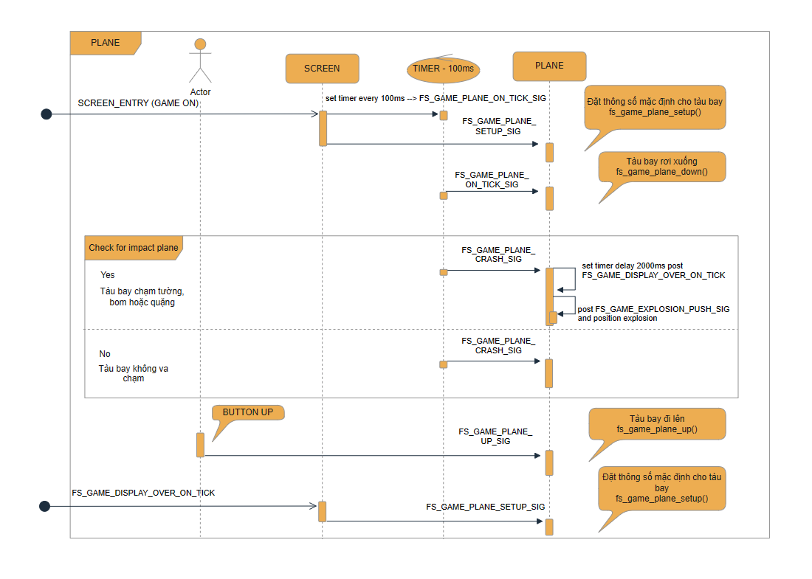
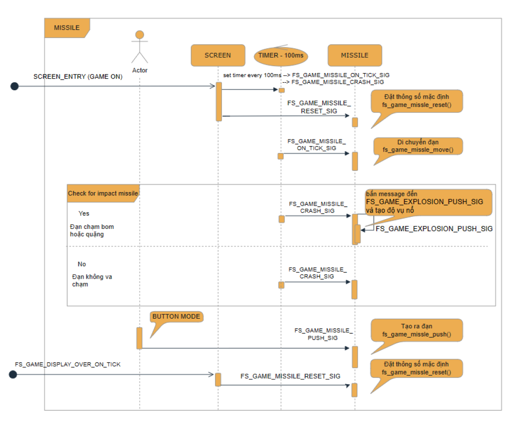
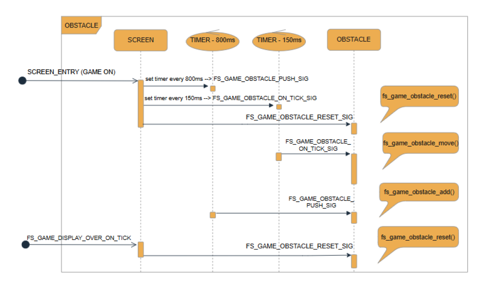
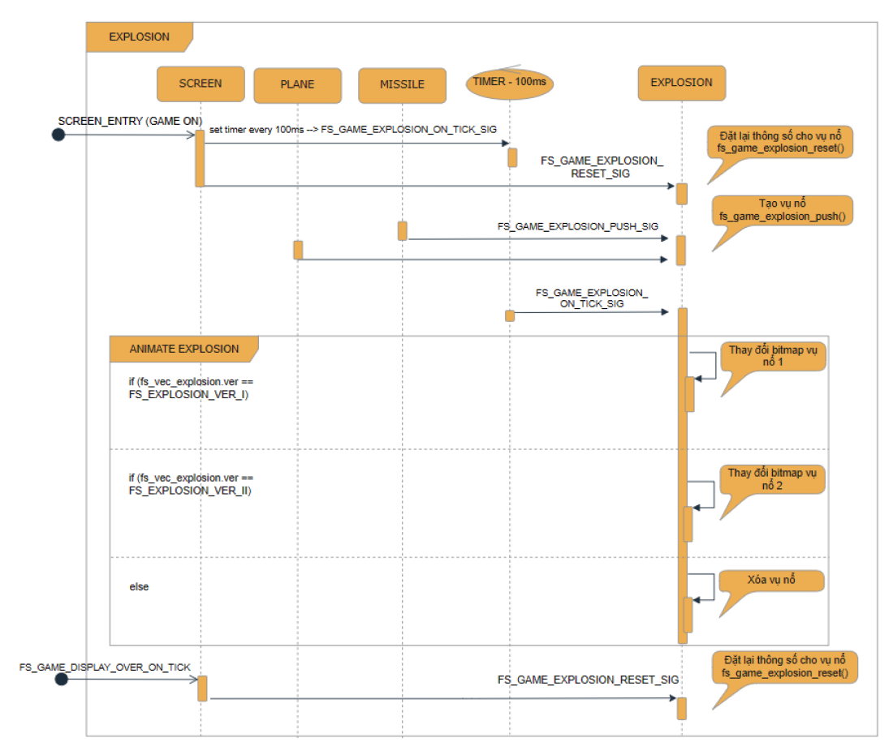
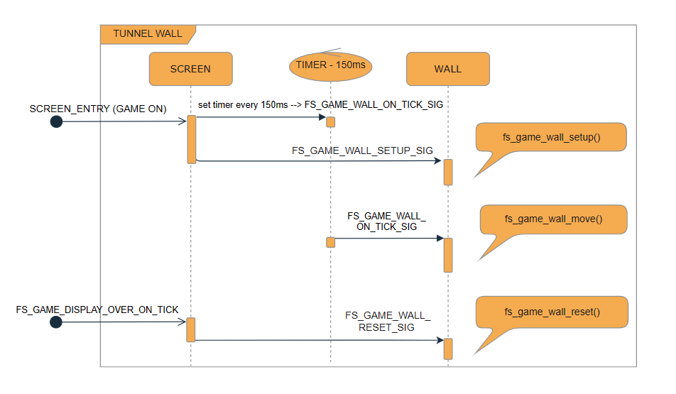

# III. Chi tiết code các đối tượng trong game

[Quay lại README](../README.md)

## 3.1. Tàu bay (Plane)

Mỗi đối tượng có các thông số để điều khiển đối tượng đó.

```cpp
typedef struct
{
    int8_t x;
    int8_t y;
} fs_game_coordinate_t;

typedef struct {
    bool visible;
    fs_game_coordinate_t coordinate;
} fs_plane_info_t;

extern fs_plane_info_t fs_plane;
```

Thông số tàu bay được lưu vào struct để dễ quản lý. Struct lồng thêm `fs_game_coordinate_t` để quản lý tọa độ. Biến `visible` quản lý trạng thái ẩn/hiện của tàu bay.



Hình 3.1.1: Plane sequence

**Phần 1:** Trước khi vào game có signal `SCREEN_ENTRY`, cài đặt timer 100ms bắn message đến `FS_GAME_PLANE_ON_TICK_SIG` và `FS_GAME_PLANE_CRASH_SIG`.

**Phần 2:**
- *Khi không có tác động người chơi:* tàu bay mỗi 100ms di chuyển xuống và kiểm tra va chạm.
    - Có: bắn message đến `FS_GAME_EXPLOSION_PUSH_SIG` kèm tọa độ vụ nổ, cài đặt delay 2000ms bắn message đến `FS_GAME_DISPLAY_OVER_ON_TICK` để tạo hiệu ứng chờ trước khi game over.
    - Không: không làm gì.
- *Khi có tác động người chơi:* nhấn nút [UP] bắn message đến `FS_GAME_PLANE_UP_SIG` giúp tàu bay đi lên.

**Phần 3:** Khi có tín hiệu `FS_GAME_DISPLAY_OVER_ON_TICK` cài đặt lại thông số cho tàu bay.

Đoạn code trong source:

Tín hiệu `FS_GAME_PLANE_SETUP_SIG`:

```cpp
static inline void fs_game_plane_setup() {
    fs_plane.coordinate.x = 5;
    fs_plane.coordinate.y = 15;
    fs_plane.visible = true;
}
```

Tín hiệu `FS_GAME_PLANE_DOWN_SIG`:

```cpp
static inline void fs_game_plane_down() {
    fs_plane.coordinate.y += FS_PLANE_Y_DOWN;
    if (fs_plane.coordinate.y > MAP_HEIGHT) {
        fs_plane.visible = false;
        fs_plane.coordinate.y = MAX_LCD_HEIGHT;
    }
}
```

Tín hiệu `FS_GAME_PLANE_UP_SIG`:

```cpp
static inline void fs_game_plane_up() {
    fs_plane.coordinate.y -= FS_PLANE_Y_UP;
}
```

Tín hiệu `FS_GAME_PLANE_CRASH_SIG`:

```cpp
static inline void fs_game_wall_crash() {
    // code
}
static inline void fs_game_obstacle_crash() {
    // code
}
static inline void fs_game_plane_crash() {
    if (fs_state_game == FS_GAME_ON) {
        fs_game_obstacle_crash();
        fs_game_wall_crash();
    }
}
```

Cài timer khi tàu bay va chạm:

```cpp
timer_set(FS_GAME_TASK_DISPLAY_GAME_OVER_ID, FS_GAME_DISPLAY_OVER_ON_TICK, AC_GAME_OVER_INTERNAL, TIMER_ONE_SHOT);
```

Lấy tọa độ khi tàu bay va chạm:

```cpp
fs_explosion.coordinate.x = fs_plane.coordinate.x;
fs_explosion.coordinate.y = fs_plane.coordinate.y;
fs_explosion.ver = FS_EXPLOSION_VER_I;
task_post_pure_msg(FS_GAME_TASK_EXPLOSION_ID, FS_GAME_EXPLOSION_PUSH_SIG);
```

## 3.2. Đạn (Missile)

Tương tự như tàu bay, đạn cũng có biến quản lý thông số:

```cpp
class fs_missile_info_t {
   public:
    bool visible;
    fs_game_coordinate_t coordinate;
    fs_missile_info_t(uint8_t x, uint8_t y, bool visible) {
        this->coordinate.x = x;
        this->coordinate.y = y;
        this->visible = visible;
    }
};

vector<fs_missile_info_t> fs_vec_missile;
```

Số đạn tối đa lấy từ cài đặt game (`FS_MAX_MISSLE` = `fs_game_setting.fs_setting_missle`, từ 1 đến 5).



Hình 3.2.1: Missile sequence

**Phần 1:** Trước khi bắt đầu vào game có signal `SCREEN_ENTRY`, đặt lại thông số cho missile và xóa missile trước đó (nếu có). Cài đặt timer mỗi 100ms bắn message đến `FS_GAME_MISSLE_ON_TICK_SIG`, `FS_GAME_MISSLE_CRASH_SIG`.

**Phần 2:**
- *Khi không có tác động người chơi:*
    - Đạn (nếu có) di chuyển từ trái sang phải mỗi 100ms.
    - Kiểm tra đạn (nếu có) va chạm với bom, quặng hay không.
        - Có: bắn message đến `FS_GAME_EXPLOSION_PUSH_SIG` kèm tọa độ vụ nổ và cộng điểm.
            - Quặng 1: cộng 1 điểm.
            - Quặng 2: cộng 2 điểm.
            - Bom: không có điểm.
        - Không: không làm gì.
- *Khi có tác động người chơi:* nhấn nút [MODE] bắn message đến `FS_GAME_MISSLE_PUSH_SIG` tạo ra đạn với số lượng tùy cài đặt (tối đa 5 viên).

**Phần 3:** Khi có tín hiệu `FS_GAME_DISPLAY_OVER_ON_TICK` xóa hết đạn (nếu có) và cài đặt lại thông số.

Đoạn code trong source:

Tín hiệu `FS_GAME_MISSLE_RESET_SIG`:

```cpp
// clear all missile available
static inline void fs_game_missle_reset() {
    //code
}
```

Tín hiệu `FS_GAME_MISSLE_PUSH_SIG`:

```cpp
// add missile to missile managerment
static inline void fs_game_missle_push() {
    //code
}
```

Tín hiệu `FS_GAME_MISSLE_ON_TICK_SIG`:

```cpp
// move all missile to right screen
static inline void fs_game_missle_move() {
    // code
}
```

Tín hiệu `FS_GAME_MISSLE_CRASH_SIG`:

```cpp
// missile hits mine or bom
static inline void fs_game_missle_crash() {
    // code
}
```

Code bắn message đến `FS_GAME_EXPLOSION_PUSH_SIG` kèm tọa độ để tạo vụ nổ:

```cpp
fs_explosion.coordinate.x = fs_vec_obstacle[k].coordinate.x;
fs_explosion.coordinate.y = fs_vec_obstacle[k].coordinate.y;
fs_explosion.ver = FS_EXPLOSION_VER_I;

task_post_pure_msg(FS_GAME_TASK_EXPLOSION_ID, FS_GAME_EXPLOSION_PUSH_SIG);
```

## 3.3. Vật cản (Obstacle)

Các quặng và bom được tạo ra từ bảng quản lý obstacle.

Biến quản lý obstacle:

```cpp
/*
*   TABLE MANAGER OBSTACLE (ID, COORDINATE, BITMAP, SCORE)
*   obstacle_tbl:
*       Size Bitmap MUST 5x5 pixel
*/
#define FS_OBSTACLE_TBL   (3)
const fs_obstacle_info_t obstacle_tbl[FS_OBSTACLE_TBL] = {
    {FS_BOM_ID     , {0,0}, bom_icon    , 0},
    {FS_MINE_I_ID  , {0,0}, mine_I_icon , 1},
    {FS_MINE_II_ID , {0,0}, mine_II_icon, 2},
};

/*
*   fs_vec_obstacle : VARIABLE CONTROL OBSTACLE
*/
vector<fs_obstacle_info_t> fs_vec_obstacle;
```

Có 3 loại vật cản: bom, quặng 1, quặng 2, với thông số ID, tọa độ điểm gốc, bitmap (5x5) và số điểm khi đạn bắn trúng. Có thể thêm vật cản mới vào bảng này.



Hình 3.3.1: Obstacle sequence

**Phần 1:** Trước khi chuyển vào màn hình game có tín hiệu `SCREEN_ENTRY`, xóa tất cả quặng (nếu có). Cài đặt timer:
- Mỗi 150ms bắn message đến `FS_GAME_OBSTACLE_ON_TICK_SIG`.
- Mỗi 800ms bắn message đến `FS_GAME_OBSTACLE_PUSH_SIG`.

**Phần 2:**
- Mỗi 150ms quặng di chuyển sang phải qua `FS_GAME_OBSTACLE_ON_TICK_SIG`.
- Mỗi 800ms quặng 1, quặng 2, bom được tạo ra ở vị trí ngẫu nhiên ở cuối hầm qua `FS_GAME_OBSTACLE_PUSH_SIG`.

**Phần 3:** Khi có tín hiệu `FS_GAME_DISPLAY_OVER_ON_TICK` xóa hết quặng (nếu có) và cài đặt lại thông số.

Tín hiệu `FS_GAME_OBSTACLE_RESET_SIG`:

```cpp
// clear all obstacle
static inline void fs_game_obstacle_reset() {
    //code
}
```

Tín hiệu `FS_GAME_OBSTACLE_ON_TICK`:

```cpp
// move all obstacle
static inline void fs_game_obstacle_move() {
    //code
}
```

Tín hiệu `FS_GAME_OBSTACLE_PUSH_SIG`:

```cpp
// add obstacle to obstacle managerment
static inline void fs_game_obstacle_push() {
    //code
}
```

## 3.4. Vụ nổ (Explosion)

Tương tự các đối tượng khác, vụ nổ có khối quản lý riêng.

```cpp
typedef enum  {
    FS_EXPLOSION_VER_I = -1,
    FS_EXPLOSION_VER_II,
    FS_EXPLOSION_VER_III
} fs_ver_info_t;

typedef struct {
    fs_game_coordinate_t coordinate;
    fs_ver_info_t ver;
} fs_explosion_info_t;

vector<fs_explosion_info_t> fs_vec_explosion;
extern fs_explosion_info_t fs_explosion;
```

Vụ nổ có 3 phiên bản hình ảnh (`FS_EXPLOSION_VER_I`, `FS_EXPLOSION_VER_II`, `FS_EXPLOSION_VER_III`) dùng để tạo hoạt ảnh tuần tự.



Hình 3.4.1: Explosion sequence

**Phần 1:** Trước khi chuyển vào màn hình game có tín hiệu `SCREEN_ENTRY`, xóa tất cả vụ nổ (nếu có) và cài đặt timer mỗi 100ms bắn message đến `FS_GAME_EXPLOSION_ON_TICK_SIG`.

**Phần 2:**
- Khi có tín hiệu va chạm từ tàu bay hay đạn, `FS_GAME_EXPLOSION_PUSH_SIG` tạo ra vụ nổ ở tọa độ đó.
- Mỗi 100ms `FS_GAME_EXPLOSION_ON_TICK_SIG` chuyển đổi giữa các phiên bản vụ nổ. Khi hoàn tất vòng hoạt ảnh thì xóa vụ nổ.

**Phần 3:** Khi có tín hiệu `FS_GAME_DISPLAY_OVER_ON_TICK` xóa tất cả vụ nổ (nếu có) và đặt lại thông số.

Tín hiệu `FS_GAME_EXPLOSION_RESET_SIG`:

```cpp
// clear all explosion
void fs_game_explosion_reset() {
    //code
}
```

Tín hiệu `FS_GAME_EXPLOSION_PUSH_SIG`:

```cpp
// add explosion to explosion managerment
void fs_game_explosion_push() {
    // code
}
```

Tín hiệu `FS_GAME_EXPLOSION_ON_TICK_SIG`:

```cpp
// animate explosion and erase when complete
void fs_game_explosion_update() {
    //code
}
```

## 3.5. Đường hầm (Tunnel Wall)

Tương tự các đối tượng khác, đường hầm có biến quản lý riêng.

```cpp
typedef enum {
    FS_WALL_I = 0,
    FS_WALL_II
} fs_ver_wall_t;

typedef struct {
    int16_t x;
    int8_t y;
    fs_ver_wall_t ver;
} fs_wall_info_t;

/*
* fs_vec_limit_wall_y : VECTOR WALL TOP AND BOT LIMMIT MANAGERMENT
*/
vector<vector<uint8_t>> fs_vec_limit_wall_y;

/*
* fs_vec_wall : VECTOR WALL MANAGERMENT
*/
vector<fs_wall_info_t> fs_vec_wall;
```



Hình 3.5.1: Tunnel Wall Sequence

**Phần 1:** Trước khi chuyển vào màn hình game có tín hiệu `SCREEN_ENTRY`, tạo ra 2 đường hầm liên tiếp và cài đặt timer mỗi 150ms bắn message đến `FS_GAME_WALL_ON_TICK_SIG`.

**Phần 2:**
- Mỗi 150ms `FS_GAME_WALL_ON_TICK_SIG` làm tường di chuyển từ phải sang trái, làm mới giới hạn đường hầm do đường hầm có những đoạn nhấp nhô.

**Phần 3:** Khi có tín hiệu `FS_GAME_DISPLAY_OVER_ON_TICK` xóa đường hầm để giải phóng bộ nhớ.

Tín hiệu `FS_GAME_WALL_SETUP_SIG`:

```cpp
// set default for all wall
static inline void fs_game_wall_setup() {
    //code
}
```

Tín hiệu `FS_GAME_WALL_ON_TICK_SIG`:

```cpp
// move wall to left
static inline void fs_game_wall_move() {
    // code
}
```

Tín hiệu `FS_GAME_WALL_RESET_SIG`:

```cpp
// clear all wall
static inline void fs_game_wall_reset() {
    // code
}
```

[Quay lại README](../README.md)
