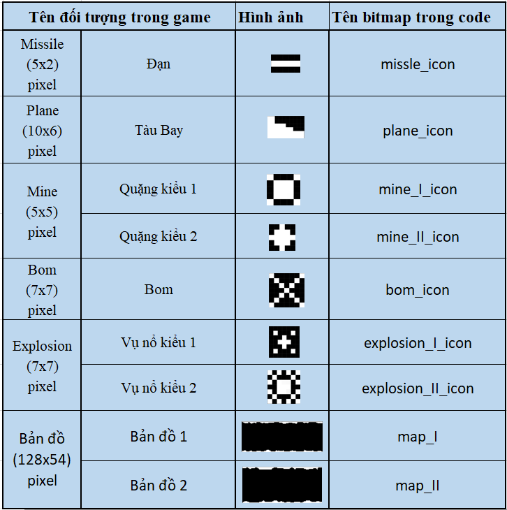

# IV. Các hình ảnh trong game

[⬅ Quay lại README](../README.md)

Để tạo hình ảnh sinh động, project sử dụng [Photopea | Online Photo Editor](https://www.photopea.com/) để thiết kế đối tượng và [image2cpp (javl.github.io)](https://javl.github.io/image2cpp/) để chuyển đổi hình ảnh sang mã hex đưa vào code. Mỗi hình ảnh tạo ra biến tương ứng như cột 4.

**Animation:**

- Vụ nổ sử dụng 3 hình ảnh tuần tự để tạo hoạt ảnh linh động.
- Đường hầm gồm 2 bản đồ nối liên tiếp nhau: đầu bản đồ 2 nối vào cuối bản đồ 1, khi bản đồ 1 chạy hết nối vào cuối bản đồ 2. Cứ vậy tạo vòng lặp vô hạn, tạo cảm giác không có điểm dừng.

[⬅ Quay lại README](../README.md)
