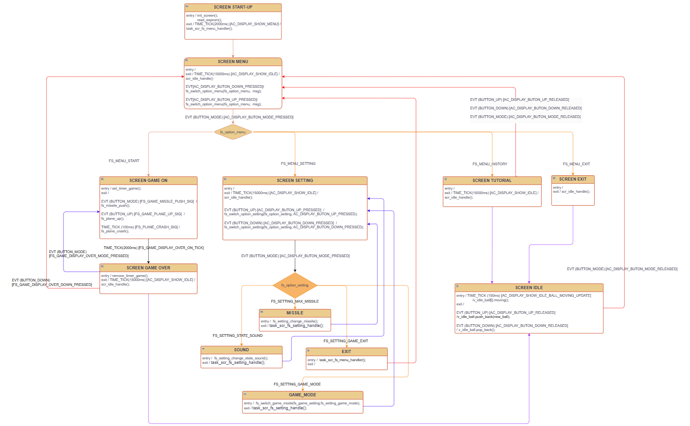

# VI. State-machine các màn hình

[Quay lại README](../README.md)

Các màn hình cụ thể trong game:

- **SCREEN START-UP:** Khi mới khởi động hiện logo AK.
    - Khởi tạo màn hình.
    - Đọc dữ liệu cài đặt và lịch sử từ eeprom.
    - Đặt time-out chuyển sang SCREEN MENU.
- **SCREEN MENU:** có 5 mục PLAY, SETTING, TUTORIAL, HISTORY, EXIT.
    - [DOWN] / [UP]: gọi `fs_switch_option_menu` chuyển đổi các mục.
    - [MODE]: chuyển sang mục tương ứng.
    - EXIT: chuyển thẳng sang SCREEN IDLE.
- **SCREEN GAME ON:** khi vào, cài đặt timer cho các đối tượng.
    - [MODE]: tạo event `FS_GAME_MISSLE_PUSH_SIG` gọi `fs_missle_push` bắn đạn.
    - [UP]: tạo event `FS_GAME_PLANE_UP_SIG` gọi `fs_plane_up` giúp tàu bay đi lên.
    - TIME_TICK: mỗi 100ms tạo event `FS_GAME_CRASH_SIG` gọi `fs_plane_crash` kiểm tra va chạm.
    - Khi va chạm: cài time-out bắn đến `FS_GAME_DISPLAY_OVER_ON_TICK` và chuyển sang SCREEN GAME OVER.
- **SCREEN GAME OVER:** khi chuyển sang, xóa tất cả timer của đối tượng và lưu điểm vào eeprom.
    - [MODE]: tạo event `FS_GAME_DISPLAY_OVER_MODE_PRESSED` quay lại SCREEN GAME ON chơi tiếp.
    - [DOWN]: tạo event `FS_GAME_DISPLAY_OVER_DOWN_PRESSED` quay về SCREEN MENU.
- **SCREEN SETTING:** có 4 mục GAME MODE, MISSILE, SOUND, EXIT.
    - [UP] / [DOWN]: gọi `fs_switch_option_setting` chuyển đổi mục.
    - [MODE]: cài đặt theo từng mục.
        - GAME MODE: chọn độ khó EASY, NORMAL, HARD.
        - MISSILE: chọn số đạn tối đa (1 - 5).
        - SOUND: bật/tắt âm thanh.
        - EXIT: lưu cài đặt vào eeprom và chuyển về SCREEN MENU.
- **SCREEN TUTORIAL:** hiện QR hướng dẫn.
    - [DOWN] / [UP] / [MODE]: về SCREEN MENU.
- **SCREEN HISTORY:** hiện lịch sử điểm (12 điểm gần nhất, 3 điểm mỗi trang).
    - [UP] / [DOWN]: đổi trang/xem các mốc điểm.
    - [MODE]: về SCREEN MENU.
- **SCREEN IDLE:** màn hình nghỉ với các bong bóng.
    - [UP]: thêm bong bóng; nếu đạt tối đa sẽ có tiếng âm thanh.
    - [DOWN]: xóa bớt bong bóng; nếu không còn bong bóng sẽ có tiếng âm thanh.
    - [MODE]: chuyển sang SCREEN MENU.

Code các màn hình nằm trong folder `application/sources/app/game/screens/`.

[Quay lại README](../README.md)
